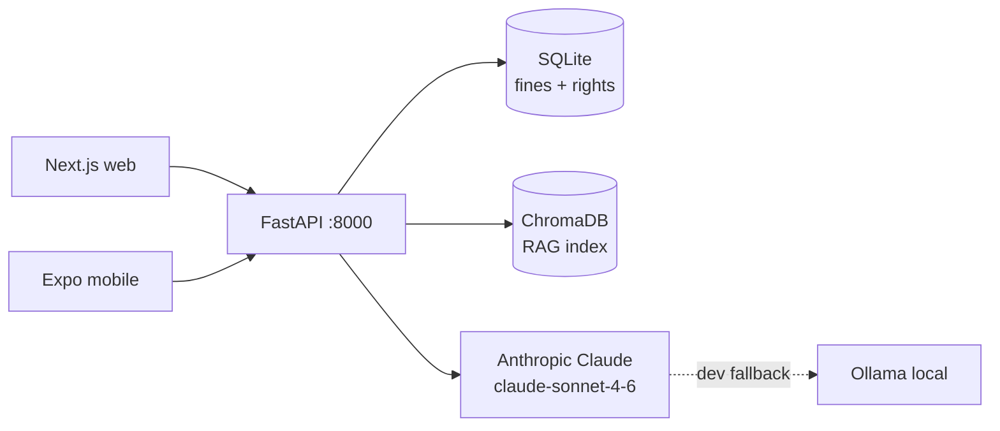

# DriveLegal

Location-aware traffic-law assistant — know the fine, know your rights, catch the scam.

**Road Safety Hackathon 2026 · CoERS / RBG Labs / IIT Madras — DriveLegal track.**

---

## What is this?

Most drivers have no idea what a traffic fine actually costs in their city, and legal language in the Motor Vehicles Act and state rules is inaccessible to the average person — leaving corrupt or mistaken on-the-spot demands unchallenged.

DriveLegal is a four-tool web and mobile app that answers traffic-law questions with RAG-grounded, cited answers; calculates the exact statutory challan for any city and violation; verifies whether what an officer demanded matches the official amount; and shows jurisdiction-specific know-your-rights cards — all in English and Hindi, with offline capability for low-network conditions.

---

## Live demo

- Backend API: <!-- TODO: fill in -->
- Web app: <!-- TODO: fill in -->
- Android APK download: <!-- TODO: fill in -->
- Demo video: <!-- TODO: fill in -->

---

## Repo layout

| Path | Purpose |
| --- | --- |
| `drivelegal/` | FastAPI backend, SQLite + ChromaDB RAG, Claude/Ollama LLM |
| `drivelegal-web/` | Next.js App Router client, bilingual EN/HI, offline-capable |
| `drivelegal-mobile/` | Expo React Native client, same surface as web |

---

## Quick start

**Backend**

```bash
cd drivelegal && python3 -m venv .venv && source .venv/bin/activate && pip install -r requirements.txt && cp .env.example .env && python -m scripts.seed_all && uvicorn app.main:app --reload --port 8000
```

**Web**

```bash
cd drivelegal-web && npm i && NEXT_PUBLIC_API_BASE=http://localhost:8000 npm run dev
```

**Mobile**

```bash
cd drivelegal-mobile && npm i && EXPO_PUBLIC_API_BASE=http://<lan-ip>:8000 npx expo start
```

---

## Architecture



---

## Eval-criteria alignment

- **Legal accuracy** — every fine is stored with its MV Act / state-schedule section reference; ChromaDB RAG grounds Claude answers in the legal corpus; low-confidence responses are flagged automatically.
- **Calculator correctness** — `POST /api/challan` returns statutory first/repeat amount, suspension days, compoundability, and payment URL, validated by 18 passing backend unit tests.
- **Information integration across countries** — India (national + 5 states), UK, UAE, and USA (4 states) in one unified API; currency, section reference, and rights data adapt per jurisdiction across 120+ fine entries.
- **UI and accessibility** — bilingual EN/HI toggle on every screen; semantic HTML; mobile-responsive Next.js web and Expo native clients; service-worker offline cache for low-bandwidth highway conditions.

---

## Links

- [Pitch deck](./PITCH.md)
- [Demo script](./DEMO_SCRIPT.md)
- [Backend deploy](./BACKEND_DEPLOY.md)
- [Web deploy](./WEB_DEPLOY.md)
- [Mobile deploy](./MOBILE_DEPLOY.md)
- [API contract](./drivelegal/docs/api_contract.md)

---

## Team

<!-- TODO: team names + roles -->

---

## License

MIT — see [LICENSE](./LICENSE).
